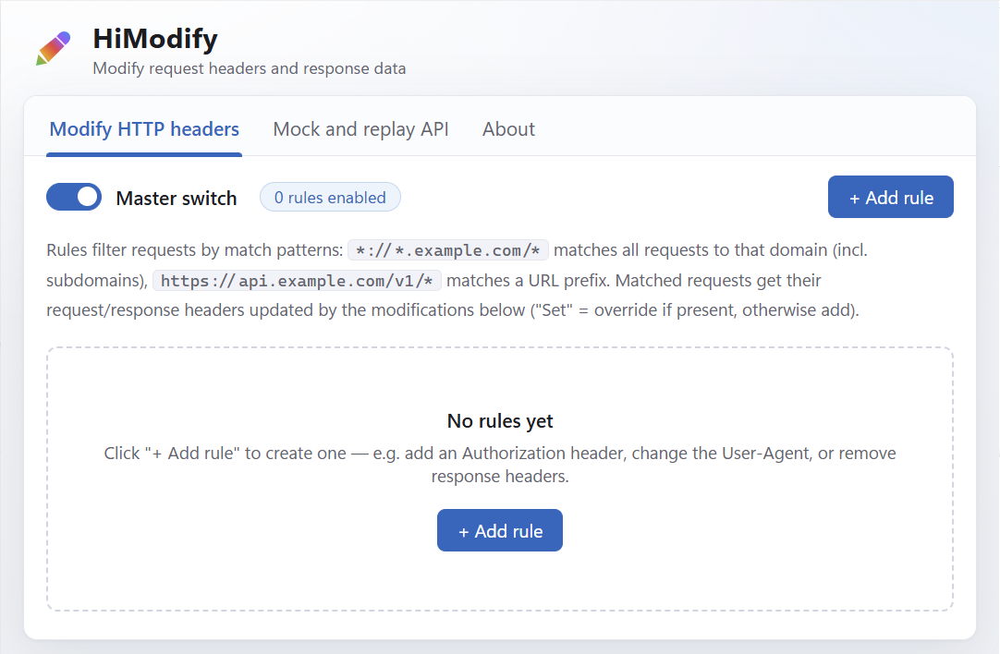
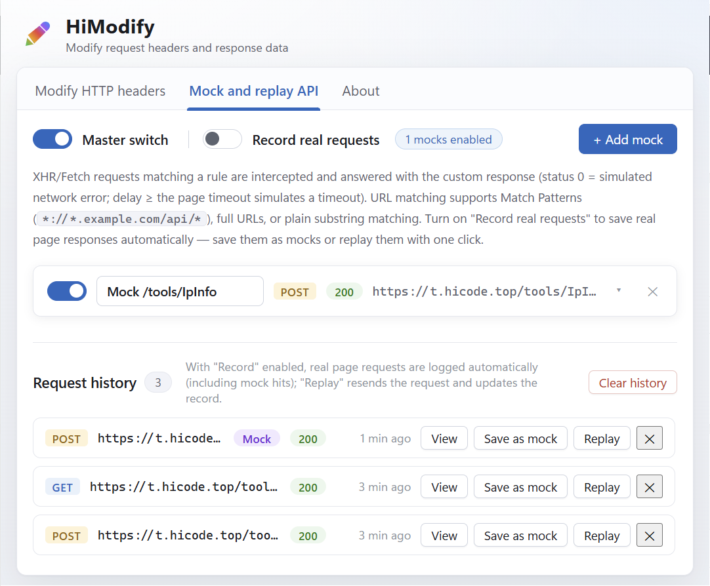

# HiModify

[](https://github.com/hicode0101/HiModify/actions/workflows/build.yml)

[简体中文](README.md) | English

<p align="left">
  
</p>

**HiModify** is a Chrome extension (Manifest V3) for modifying request headers and response data, combining two everyday debugging tools in one place:

- **Modify HTTP headers**: add, override, append or remove request/response headers by domain/URL rules, with multiple independently toggleable rules
- **Mock and replay API**: intercept XHR/Fetch requests and answer them with custom status codes, bodies and delays; record real API responses as mocks, replay past requests with one click, and switch between real/mocked APIs anytime

Fluent-design UI (Windows 11 style) with Chinese/English language switching. Front-end parallel development, API debugging, error-scenario simulation and multi-device testing — all covered by one extension.



## Table of Contents

- [Installation](#installation)
- [Feature 1: Modify HTTP headers](#feature-1-modify-http-headers)
- [Feature 2: Mock and replay API](#feature-2-mock-and-replay-api)
- [About tab: language & config import/export](#about-tab-language--config-importexport)
- [How it works](#how-it-works)
- [Permissions](#permissions)
- [FAQ](#faq)

## Installation

### Option 1: Install from release zip (recommended)

1. Download [`himodify-1.0.0-chrome.zip`](https://github.com/hicode0101/HiModify/releases) and unzip it (or build it yourself, see below)
2. Open `chrome://extensions` and turn on **Developer mode** (top right)
3. Click **Load unpacked** and select the unzipped directory

### Option 2: Build from source

```bash
git clone https://github.com/hicode0101/HiModify.git
cd HiModify
npm install
npm run build
```

The build output is in `.output/chrome-mv3`. Then load it into the browser:

1. Open Chrome and go to `chrome://extensions`
2. Turn on **Developer mode** (top right)
3. Click **Load unpacked** and select the `.output/chrome-mv3` directory
4. The HiModify pencil icon appears in the toolbar — you're done

### Option 3: Development mode

```bash
npm run dev
```

Launches a dedicated Chrome window with the extension loaded and hot-reloads on code changes.

> Requires Chrome 111 or later.

## Feature 1: Modify HTTP headers

Open the extension page from the toolbar — you start on the **Modify HTTP headers** tab. The core concept is simple: **one rule = match patterns (which requests) + modifications (what to change)**.

### Steps

1. Click **＋ Add rule** (top right)
2. Fill in **match patterns**, one per line
3. Add **modifications**: pick the target (request/response headers), the action (set/override, append, remove) and the header name/value
4. Keep both the rule switch and the master switch on, then visit a matching site

### Match pattern syntax

| Pattern | Matches |
| --- | --- |
| `*://*.example.com/*` | All requests to example.com and all its subdomains (most common) |
| `https://api.example.com/v1/*` | Requests under `/v1/` on that host |
| `*://example.com/login*` | Only login-related pages of example.com |
| `*://*/*` | Every request to every site (use with care) |

Syntax is `<scheme>://<host>/<path>`: scheme `*` means http/https; host `*.example.com` includes subdomains; `*` in the path matches any characters. You can also paste a full URL (exact match when no wildcards are used).

### Example 1: Attach a token to an API for backend debugging

The API at `https://api.example.com` requires an Authorization header that the browser doesn't have:

- Match pattern: `https://api.example.com/*`
- Modification: `Request headers` + `Set / override` + name `Authorization`, value `Bearer eyJhbGciOi...`

From now on every request to that API automatically carries the token.

### Example 2: Spoof a mobile User-Agent

To see the mobile version of a site:

- Match pattern: `*://*.example.com/*`
- Modification: `Request headers` + `Set / override` + name `User-Agent`, value `Mozilla/5.0 (iPhone; CPU iPhone OS 17_0 like Mac OS X) AppleWebKit/605.1.15 (KHTML, like Gecko) Version/17.0 Mobile/15E148 Safari/604.1`

### Example 3: Remove response headers while debugging

A page can't be embedded in an iframe because of `X-Frame-Options: DENY`, or scripts get blocked by `Content-Security-Policy`:

- Match pattern: `https://dev.example.com/*`
- Modification: `Response headers` + `Remove` + name `X-Frame-Options`
- Add another one: `Response headers` + `Remove` + name `Content-Security-Policy`

### Tips

- **Multiple modifications**: one rule can carry any number of modifications — change the UA and attach a token at the same time
- **Pause instead of delete**: toggle a single rule off, or flip the master switch to disable everything
- **Append vs set**: `Set / override` replaces the header if present and adds it otherwise; `append` keeps the original value and adds yours after it (handy for merging cookies)
- The number badge on the toolbar icon = enabled rule count, so you can tell at a glance the extension is active

## Feature 2: Mock and replay API



Switch to the **Mock and replay API** tab. XHR/Fetch requests matching a rule never reach the server — **the response you defined is returned directly inside the page**. Unfinished backend endpoints and hard-to-reproduce error scenarios are now under your control.

### Steps

1. Click **＋ Add mock** and expand the card
2. Fill in the **URL match pattern**: a Match Pattern (`*://*.example.com/api/*`), a full URL (`https://api.example.com/v1/user`) or a plain keyword (`/v1/user`, substring match)
3. Pick the **method** (ANY = any), then the **status code**, **delay**, **Content-Type** and **response body**
4. Make sure the master switch is on and refresh the target page — your mock data is served

### Example 1: Front-end development before the API exists

The backend's user endpoint `/v1/user` isn't ready yet:

- URL pattern: `https://api.example.com/v1/user`, method `GET`
- Status `200`, Content-Type `application/json`
- Response body:

```json
{
  "code": 0,
  "data": { "id": 1, "name": "HiModify", "vip": true }
}
```

Your UI renders against stable data right away. When the real API is ready, turn the rule (or the master switch) off to switch back.

### Example 2: Simulate error scenarios to test error handling

| Scenario | Configuration |
| --- | --- |
| Server error 500 | Status `500`, any body |
| Unauthorized 401 | Status `401` |
| Empty data | Status `200`, body `{"code":0,"data":null}` |
| Network failure | Status `0` (network error) |
| Request timeout | Delay `10000` ms (anything ≥ the page's XHR timeout triggers `timeout`) |

The body editor has a one-click **Format JSON** button and shows the character count live.

### Example 3: Record real APIs, save as mock, replay

To capture real responses and reuse them:

1. Turn on **Record real requests**
2. Browse normally — every XHR/Fetch request is logged under **Request history** (method, URL, status, body; up to 100 entries)
3. For any entry:
   - **View** expands the full URL, request body and response body
   - **Save as mock** generates a matching mock rule (status, Content-Type and body filled in automatically) that you can tweak into a "stable" endpoint
   - **Replay** re-sends the request from the extension's background and updates the record — perfect for reproducing flaky bugs

> Mock hits also appear in the history (with a purple Mock badge), so you can confirm rules are firing.

## About tab: language & config import/export

On the **About** tab:

- **Browser language**: shows the browser UI language tag (e.g. `zh-CN`)
- **Language**: switch between `Browser language` (default, falls back to English when unmatched) / `English` / `简体中文`; the whole extension UI (popup included) switches instantly and the choice is remembered
- **Export config / Import config**: back up header rules + mock rules as a JSON file, restore them on another machine, or share one debugging setup across the team

## How it works

- **Header modification**: rules are stored in `chrome.storage.local` and converted into `chrome.declarativeNetRequest` dynamic rules (`modifyHeaders` + `regexFilter`) — executed natively by the browser with zero overhead
- **Mock / recording**: a hook is injected into the page's MAIN world at `document_start`, overriding `window.fetch` and `window.XMLHttpRequest`; matching requests are answered after the configured delay, while an isolated-world bridge script passes config down and records up via `postMessage`
- **Replay**: performed by the background service worker with a plain `fetch` (host permissions included, immune to page CORS)

## Permissions

| Permission | Purpose |
| --- | --- |
| `storage` / `unlimitedStorage` | Store rules and request history |
| `declarativeNetRequest` | Modify request/response headers |
| `<all_urls>` | Inject the mock hook into matching pages, record and replay requests on any site |

## FAQ

**Q: My rule doesn't seem to work?**
Make sure both the master switch and the rule switch are on; check that the pattern actually matches the target URL (paste the full URL to test); the site must be allowed in the extension's "Site access" settings on `chrome://extensions`.

**Q: Mocks only work on newly opened pages?**
Correct. The mock hook is injected when a page loads — refresh already-open pages, and refresh again after reloading the extension in development mode.

**Q: Which requests can't be mocked?**
XHR with `responseType` blob / arraybuffer / document falls through to the real request; upload progress events don't fire on the mock path.

**Q: Recorded bodies look truncated?**
Each record stores up to 200 KB of response body and 64 KB of request body.

## Development

```bash
npm install        # install dependencies
npm run dev        # dev mode with hot reload
npm run build      # production build → .output/chrome-mv3
npm run zip        # package zip (for Chrome Web Store)
npm run icons      # regenerate the logo icons
npm run compile    # TypeScript type check
```

Built with Vue 3 + WXT + TypeScript. See the source: `src/entrypoints` (background / content scripts / popup / options), `src/components` (UI), `src/i18n` + `src/locales` (internationalization).

---

Copyright by [hicode0101](https://github.com/hicode0101) · [HiModify](https://github.com/hicode0101/HiModify)
