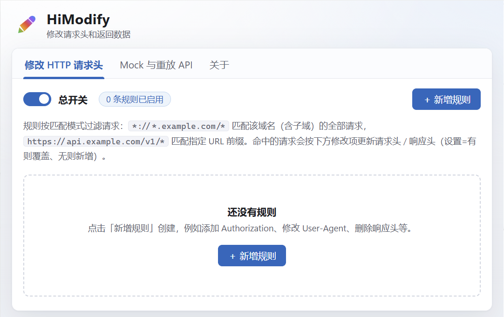

# HiModify

<p align="left">
  
</p>

**HiModify** 是一款修改请求头和返回数据的 Chrome 扩展（Manifest V3），将两类高频调试能力整合在一起：

- **修改 HTTP 请求头**：按域名 / URL 规则，对请求头、响应头进行新增、覆盖、追加、删除，可启用/禁用多条规则
- **Mock 与重放 API**：拦截页面的 XHR/Fetch 请求，自定义状态码、响应体、延迟；录制真实接口响应保存为 Mock，一键重放历史请求，随时切换真实 / 模拟接口

支持中文 / English 界面语言切换，前端并行开发、接口调试、异常场景模拟、多端适配测试，一个扩展全部搞定。



## 目录

- [安装方式](#安装方式)
- [功能一：修改 HTTP 请求头](#功能一修改-http-请求头)
- [功能二：Mock 与重放 API](#功能二mock-与重放-api)
- [关于页：语言切换与配置导入导出](#关于页语言切换与配置导入导出)
- [实现原理](#实现原理)
- [权限说明](#权限说明)
- [常见问题](#常见问题)

## 安装方式

### 方式一：从源码安装（推荐）

```bash
git clone https://github.com/hicode0101/HiModify.git
cd HiModify
npm install
npm run build
```

构建产物在 `.output/chrome-mv3` 目录，然后加载到浏览器：

1. 打开 Chrome，地址栏输入 `chrome://extensions`
2. 打开右上角「开发者模式」开关
3. 点击「加载已解压的扩展程序」，选择 `.output/chrome-mv3` 目录
4. 工具栏出现 HiModify 铅笔图标即安装成功

### 方式二：开发调试

```bash
npm run dev
```

会自动启动一个加载了扩展的独立 Chrome 窗口，修改代码后热更新。

> 要求 Chrome 111 及以上版本。

## 功能一：修改 HTTP 请求头

打开扩展页面（点击工具栏图标），默认进入「修改 HTTP 请求头」标签页。核心概念很简单：**一条规则 = 匹配模式（哪些请求生效）+ 修改项（改什么）**。

### 使用步骤

1. 点击右上角「＋ 新增规则」
2. 在「匹配规则」里每行填写一条匹配模式
3. 添加「修改项」：选择生效位置（请求头/响应头）、操作方式（设置/覆盖、追加、删除），填写 Header 名称和值
4. 保持规则开关打开（总开关也要打开），访问匹配的网站即可生效

### 匹配模式语法（Match Pattern）

| 模式 | 匹配范围 |
| --- | --- |
| `*://*.example.com/*` | example.com 及其所有子域名的全部请求（最常用） |
| `https://api.example.com/v1/*` | 该域名下以 `/v1/` 开头的请求 |
| `*://example.com/login*` | 仅 example.com 的登录相关页面 |
| `*://*/*` | 所有网站的所有请求（慎用） |

语法为 `<协议>://<主机>/<路径>`：协议 `*` 表示 http/https 均可；主机 `*.example.com` 表示包含子域；路径中的 `*` 匹配任意字符。也可以直接粘贴完整 URL（不带通配符时精确匹配）。

### 例子 1：给接口加 Token，调试后端

后端接口 `https://api.example.com` 需要 Authorization，浏览器里没登录态拿不到数据：

- 匹配规则：`https://api.example.com/*`
- 修改项：`请求头` + `设置/覆盖` + 名称 `Authorization`，值 `Bearer eyJhbGciOi...`

之后浏览器直接访问该接口域名，所有请求自动带上 Token。

### 例子 2：模拟手机 UA，测试多端适配

想看某网站返回的移动版页面：

- 匹配规则：`*://*.example.com/*`
- 修改项：`请求头` + `设置/覆盖` + 名称 `User-Agent`，值 `Mozilla/5.0 (iPhone; CPU iPhone OS 17_0 like Mac OS X) AppleWebKit/605.1.15 (KHTML, like Gecko) Version/17.0 Mobile/15E148 Safari/604.1`

### 例子 3：删除响应头，绕过限制调试

页面被 `X-Frame-Options: DENY` 限制无法嵌入 iframe、或被 `Content-Security-Policy` 拦截脚本：

- 匹配规则：`https://dev.example.com/*`
- 修改项：`响应头` + `删除` + 名称 `X-Frame-Options`
- 可再加一条：`响应头` + `删除` + 名称 `Content-Security-Policy`

### 实用技巧

- **多个修改项**：一条规则可以挂任意多个修改项，比如同时改 UA 和加 Token
- **临时停用**：用规则上的小开关单独停用某条规则，不用删除；总开关一键全部停用
- **追加 vs 设置**：`设置/覆盖` 是"有则覆盖、无则新增"；`追加` 是保留原值、在后面附加（适合 Cookie 拼接）
- 工具栏图标上的数字角标 = 当前已启用的规则数，一眼确认扩展在工作

## 功能二：Mock 与重放 API

切到「Mock 与重放 API」标签页。命中规则的 XHR/Fetch 请求不会真正发到服务器，而是**在页面内直接返回你定义的响应**——后端没写完的接口、想复现的异常场景，都能自己造。

### 使用步骤

1. 点击「＋ 新增 Mock」，展开卡片配置
2. 填写 **URL 匹配规则**：可以是 Match Pattern（`*://*.example.com/api/*`）、完整 URL（`https://api.example.com/v1/user`）或纯文本关键字（`/v1/user`，包含即命中）
3. 选择**请求方法**（ANY = 不限），填写**状态码**、**延迟**、**Content-Type** 和**响应体**
4. 确保 Mock 总开关打开，刷新目标页面即可看到模拟数据

### 例子 1：后端接口没写完，先用假数据开发页面

后端的用户信息接口 `/v1/user` 还没就绪：

- URL 匹配规则：`https://api.example.com/v1/user`，方法 `GET`
- 状态码 `200`，Content-Type `application/json`
- 响应体：

```json
{
  "code": 0,
  "data": { "id": 1, "name": "HiModify", "vip": true }
}
```

前端页面立即能拿到固定数据渲染 UI，后端联调时关掉这条规则（或总开关）即可切回真实接口。

### 例子 2：模拟异常场景，验证前端容错

| 场景 | 配置方法 |
| --- | --- |
| 服务端 500 | 状态码填 `500`，响应体随意 |
| 未登录 401 | 状态码填 `401` |
| 数据为空 | 状态码 `200`，响应体 `{"code":0,"data":null}` |
| 网络断开 | 状态码填 `0`（返回网络错误） |
| 请求超时 | 延迟填 `10000` 毫秒（大于页面的 XHR 超时时间即触发 timeout） |

响应体支持「格式化 JSON」按钮一键排版；响应体字符数实时显示。

### 例子 3：录制真实接口，一键存为 Mock / 重放

想把线上真实返回保存下来反复使用：

1. 打开工具栏里的「**录制真实请求**」开关
2. 正常浏览网页，页面发出的 XHR/Fetch 请求会自动记录到下方「**请求历史**」（每条含方法、URL、状态码、响应体，最多 100 条）
3. 对某条记录：
   - 点「**查看**」展开查看完整 URL、请求体、响应体
   - 点「**存为Mock**」一键生成对应的 Mock 规则（自动带出状态码、Content-Type、响应体），稍作修改就能变成"稳定版"接口
   - 点「**重放**」由扩展后台重新发送这条请求并更新记录——接口偶发 bug 时反复重放，配合 DevTools 稳定排查

> Mock 命中的请求也会出现在请求历史中（带紫色 Mock 标记），方便确认规则是否生效。

## 关于页：语言切换与配置导入导出

「关于」标签页中：

- **当前浏览器语言**：显示浏览器的界面语言标签（如 `zh-CN`）
- **界面语言**：下拉切换 `浏览器当前语言`（默认，识别不了时回退 English）/ `English` / `简体中文`，整个扩展界面（含弹窗）立即切换，选择会被记住
- **导出配置 / 导入配置**：把请求头规则 + Mock 规则导出为 JSON 文件备份，或在另一台电脑导入，团队内可共享同一套调试配置

## 实现原理

- **请求头修改**：规则保存到 `chrome.storage.local`，转换为 `chrome.declarativeNetRequest` 动态规则（`modifyHeaders` + `regexFilter`），由浏览器原生执行，零性能损耗
- **Mock / 录制**：在 `document_start` 时机向页面主世界（MAIN world）注入钩子，重写 `window.fetch` 与 `window.XMLHttpRequest`；命中规则的请求按配置延迟后直接返回模拟响应；隔离世界的桥接脚本通过 `postMessage` 下发配置、上报录制数据
- **重放**：由后台 Service Worker 直接 `fetch`（具备宿主权限，不受页面 CORS 限制）

## 权限说明

| 权限 | 用途 |
| --- | --- |
| `storage` / `unlimitedStorage` | 保存规则与请求历史 |
| `declarativeNetRequest` | 修改请求头 / 响应头 |
| `<all_urls>` | 在匹配页面注入 Mock 钩子、录制与重放任意站点请求 |

## 常见问题

**Q：规则配置了但不生效？**
确认总开关和规则开关都已打开；检查匹配模式是否能命中目标 URL（可直接粘贴完整 URL 测试）；Chrome 扩展详情页的「网站访问权限」需允许对应站点。

**Q：Mock 只对新打开的页面生效？**
是。Mock 钩子在页面加载时注入，已打开的页面请刷新一次；开发模式下重载扩展后也需要刷新页面。

**Q：哪些请求无法 Mock？**
`responseType` 为 blob / arraybuffer / document 的 XHR 会自动透传真实请求；XHR Mock 路径下 `upload` 上传进度事件不会触发。

**Q：录制的响应体不完整？**
每条记录响应体最多保存 200KB、请求体 64KB，超出部分截断。

## 开发

```bash
npm install        # 安装依赖
npm run dev        # 开发模式（热更新）
npm run build      # 生产构建 → .output/chrome-mv3
npm run zip        # 打包 zip（Chrome Web Store 发布用）
npm run icons      # 重新生成 Logo 图标
npm run compile    # TypeScript 类型检查
```

技术栈：Vue 3 + WXT + TypeScript。项目结构详见源码：`src/entrypoints`（background / 内容脚本 / popup / options）、`src/components`（界面组件）、`src/i18n` + `src/locales`（国际化）。

---

Copyright by [hicode0101](https://github.com/hicode0101) · [HiModify](https://github.com/hicode0101/HiModify)
